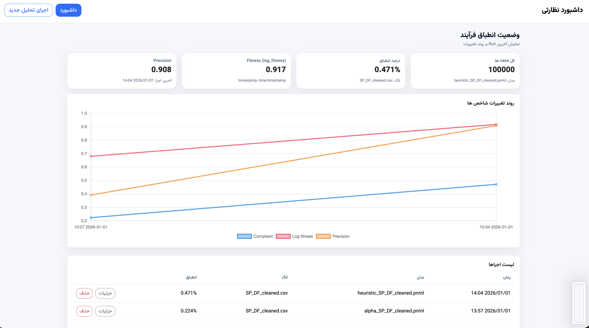
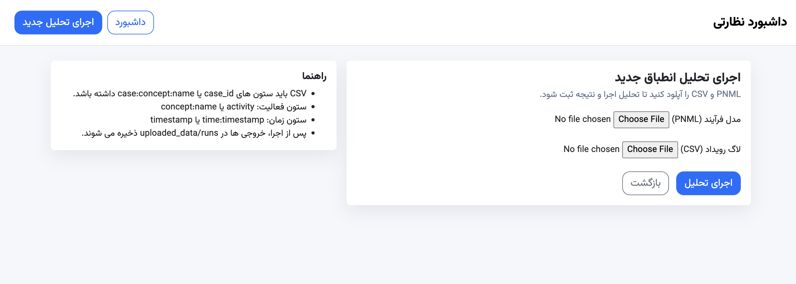
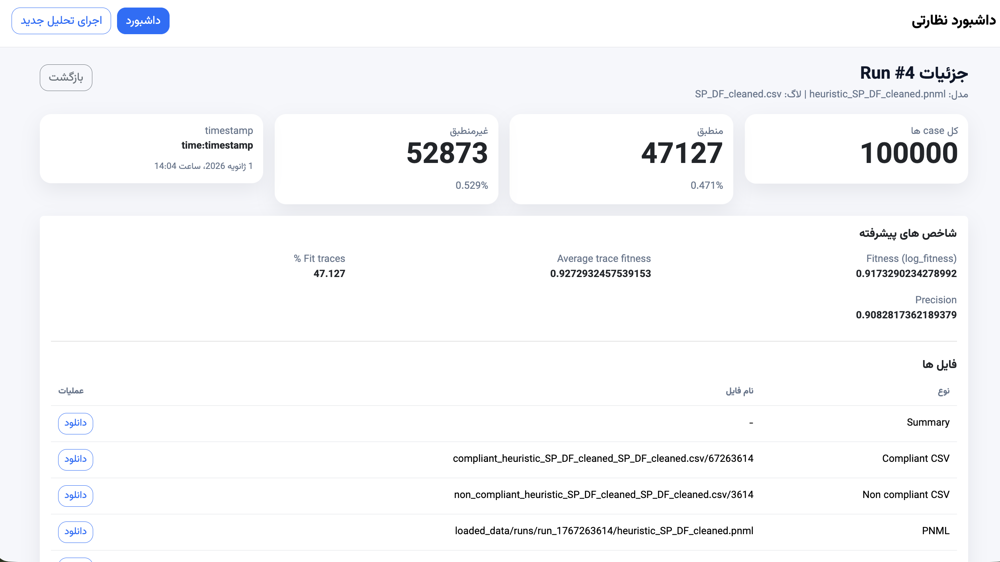

# داشبورد نظارتی تحلیل انطباق فرآیند
(Process Conformance Monitoring Dashboard)

این پروژه با هدف **تحلیل و پایش انطباق فرآیندها** طراحی شده است. سیستم با استفاده از مدل فرآیند (Petri Net) و لاگ رویداد، میزان انطباق اجرای واقعی فرآیند با مدل مرجع را محاسبه کرده و نتایج را به صورت یک **داشبورد نظارتی دوره ای** نمایش می دهد.

---


## هدف پروژه

- اجرای تحلیل انطباق فرآیند با استفاده از Token Replay
- محاسبه شاخص های کلاسیک و پیشرفته انطباق
- ذخیره نتایج هر اجرا به عنوان یک Run مستقل
- پایش تغییرات انطباق در طول زمان
- ارائه یک داشبورد تعاملی و قابل توسعه

---


## نمای کلی داشبورد

> تصویر نمونه از داشبورد نظارتی:


> تصویر صفحه آپلود و بررسی تطابق:



> تصویر صفحه جزئیات یک Run:



---
## معماری کلی سیستم

پروژه از دو بخش اصلی تشکیل شده است:

### 1) بخش تحلیل انطباق (Conformance Checking)

این بخش مستقل از Django است و با استفاده از کتابخانه PM4Py پیاده سازی شده است.

**ورودی ها**
- فایل مدل فرآیند با فرمت PNML
- فایل لاگ رویداد با فرمت CSV

**خروجی ها**
- فایل Summary با فرمت JSON
- فایل CSV کیس های منطبق
- فایل CSV کیس های غیرمنطبق

پیاده سازی در فایل:
```
conformance_runner.py
```

---

### 2) بخش داشبورد نظارتی (Monitoring Dashboard)

این بخش با Django و پایگاه داده SQLite پیاده سازی شده و فقط مصرف کننده خروجی های تحلیل انطباق است.

وظایف:
- دریافت فایل های PNML و CSV از طریق رابط کاربری
- اجرای خودکار تحلیل انطباق
- ذخیره نتایج هر اجرا به عنوان یک Run
- نمایش وضعیت فعلی و روند تغییرات شاخص ها
- مدیریت Run ها (مشاهده، حذف، دانلود خروجی ها)

---

## جریان داده (Data Flow)

```
Upload PNML & CSV
        ↓
conformance_runner.py
        ↓
Token Replay / Fitness / Precision
        ↓
JSON + CSV
        ↓
SQLite
        ↓
Monitoring Dashboard
```

---

## شاخص های محاسبه شده

### شاخص های پایه
- تعداد کل case ها
- تعداد case های منطبق
- تعداد case های غیرمنطبق
- درصد انطباق
- درصد عدم انطباق

### شاخص های پیشرفته
- Fitness (log fitness)
- Average Trace Fitness
- Percentage of Fitting Traces
- Precision

---

## ساختار پروژه

```
monitoring_dashboard/
├── manage.py
├── conformance_runner.py
├── db.sqlite3
├── monitoring_dashboard/
│   ├── settings.py
│   ├── urls.py
│   └── wsgi.py
├── monitoring/
│   ├── models.py
│   ├── views.py
│   ├── urls.py
│   ├── forms.py
│   └── templates/
│       └── monitoring/
│           ├── base.html
│           ├── index.html
│           ├── upload.html
│           └── run_detail.html
└── uploaded_data/
    └── runs/
```

---

## راه اندازی پروژه

### نصب وابستگی ها
```bash
pip install django pm4py pandas
```

### آماده سازی دیتابیس
```bash
python manage.py makemigrations
python manage.py migrate
```

### اجرای سرور
```bash
python manage.py runserver
```

داشبورد در آدرس زیر در دسترس است:
```
http://127.0.0.1:8000/
```

---

## اجرای تحلیل جدید

1. ورود به صفحه «اجرای تحلیل جدید»
2. انتخاب فایل PNML
3. انتخاب فایل CSV
4. اجرای تحلیل
5. مشاهده نتایج در داشبورد

